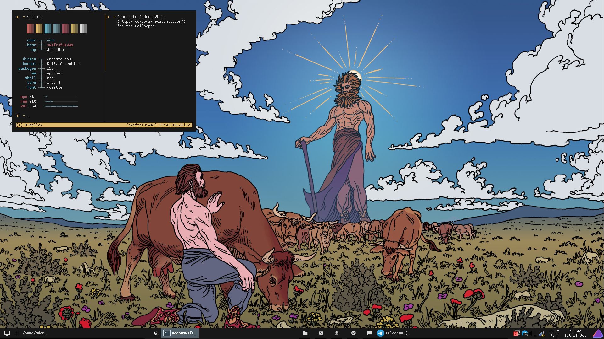

# Installation

Install xfce4-terminal, rofi, tint2, dunst & zathura

Copy all folders beginning with a . into your home directory (~/)

Copy sysinfo into /bin and give execute permissions

Copy cozette.otb into /home/user/.local/share/fonts

Copy telegram folder into ~/Documents and set theme and background via Telegram chat settings

# Credits

[pyratebeard](https://wwww.pyratebeard.net) for the colour scheme, sysinfo and general inspiration, 
[PixelArtJourney](https://twitter.com/PixelArtJourney) for the pixart wallpaper, 
[Andrew White](http://www.basileuscomic.com/) for the skyfather wallpaper, 
[oomox](https://github.com/themix-project/oomox) for giving me an easy way to export the colour scheme into various apps

